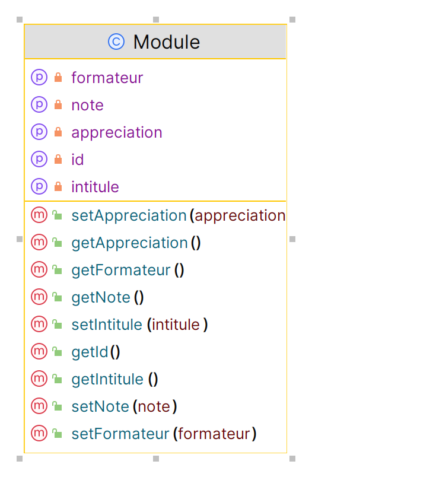

= Bilan module

== Description

Vous en avez assez des bilans modules à remplir dans un formulaire google doc illisible ? Nous aussi.

L'ENI a besoin de vous pour moderniser son système d'évaluation des fomateurs.

Vous utiliserez les technologies suivantes :

    - PHP 8
    - Symfony 6
    - Composer
    - Toutes vos connaissances

== Ajout d'un module de formation

Vous réaliserez une page permettant de renseigner le titre d'un module, le nom du formateur, une note et une appréciation.

=== Maquette

Vous pouvez vous appuyer sur la maquette suivante. Mais un meilleur CSS ne serait pas de refus.

[.text-center]

Bien entendu, le clic sur le bouton __ajouter__ permet l'ajout en base de données.

=== Diagramme de classe

Vous pouvez vous appuyer sur le diagramme de classe suivant :

[.text-center]

== Affichage des résultats

Afficher l'ensemble des modules renseignés en base de données.

=== Maquette

Vous pouvez vous appuyer sur la maquette suivante :

[.text-center]

'''

[.text-center]
